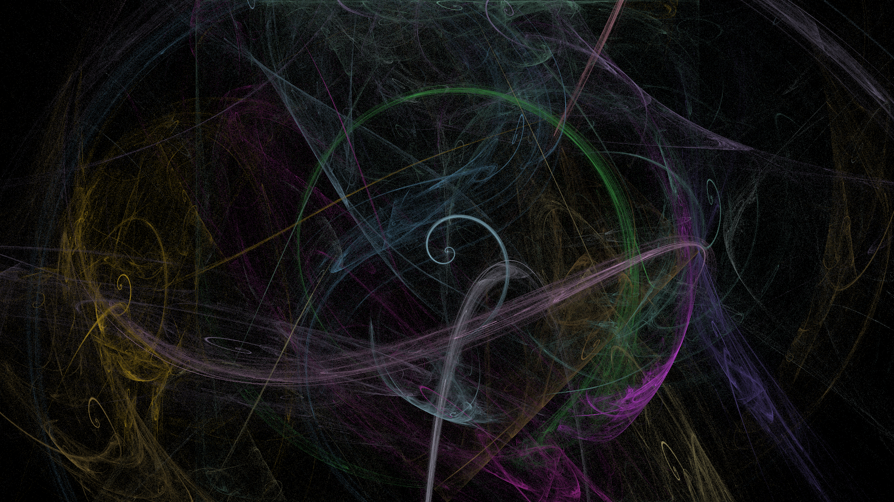
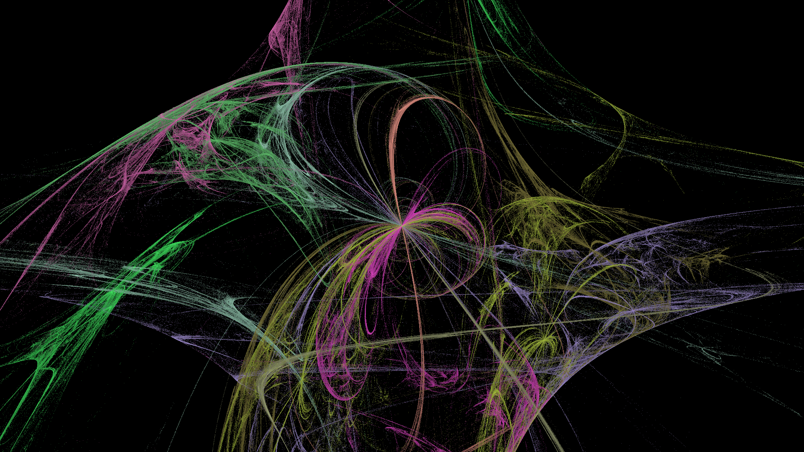

# 🔥 Flam3

Консольный генератор изображений фрактального пламени на Go. Реализует алгоритм Chaos Game с цветным рендерингом, 35 вариационными трансформациями, многопоточностью и гамма-коррекцией.

## Quick Start

```bash
git clone https://github.com/kurochkinivan/flam3.git
cd flam3

# Через JSON-конфиг
make flam3-json

# Через CLI
make flam3-cli

# Случайная генерация (200 изображений)
make flam3-random
```

Или вручную:
```bash
make build

./bin/flam3 --config=input/config.json
./bin/flam3 --width 1920 --height 1080 -i 2500 -t 8 -f swirl:1.0,horseshoe:0.7
```

## Примеры






## Флаги CLI

| Флаг | Короткий | По умолчанию | Описание |
|------|----------|--------------|----------|
| `--width` | `-w` | `1920` | Ширина изображения |
| `--height` | `-h` | `1080` | Высота изображения |
| `--iteration-count` | `-i` | `2500` | Количество итераций |
| `--threads` | `-t` | `1` | Количество потоков |
| `--output-path` | `-o` | `result.png` | Путь для сохранения PNG |
| `--seed` | | `5` | Начальное значение генератора |
| `--functions` | `-f` | — | Трансформации: `swirl:1.0,horseshoe:0.8` |
| `--affine-params` | `-ap` | — | Аффинные параметры |
| `--gamma-correction` | `-g` | — | Включить гамма-коррекцию |
| `--gamma` | | `2.2` | Значение гаммы |
| `--symmetry-level` | `-s` | — | Уровень симметрии (N поворотов) |
| `--config` | | — | Путь к JSON-конфигу |

## JSON-конфигурация

```json
{
  "size": { "width": 1920, "height": 1080 },
  "iteration_count": 2500,
  "output_path": "output/result.png",
  "threads": 8,
  "seed": 42,
  "gamma_correction": true,
  "gamma": 2.2,
  "symmetry_level": 3,
  "functions": [
    { "name": "swirl", "weight": 1.0 },
    { "name": "horseshoe", "weight": 0.7 }
  ],
  "affine_params": [
    { "a": 1.0, "b": 1.0, "c": 1.0, "d": 1.0, "e": 1.0, "f": 1.0 }
  ]
}
```

Приоритет параметров: **CLI → JSON → defaults**

## Возможности

- **35 вариационных трансформаций** (swirl, horseshoe, sinusoidal и др.)
- Однопоточный и многопоточный режимы генерации
- Логарифмическая гамма-коррекция
- Симметрия с заданным количеством поворотов
- Вывод в PNG, RGB 8 бит на канал
- Логирование прогресса через `slog`

## Make

```bash
make build              # Собрать бинарный файл → ./bin/flam3
make flam3-json         # Запуск с JSON-конфигом
make flam3-cli          # Запуск с CLI-параметрами
make flam3-random       # Генерация 200 случайных фракталов
make flam3-random-reproduce  # Воспроизвести генерацию по seed
make test               # Тесты + HTML-отчёт покрытия
```

## Тестирование

```bash
make test
```

Unit-тесты покрывают трансформации, парсеры, конфигурацию и рендеринг. Покрытие — **95%**. Black-box тесты — **100%**. Реализованы benchmark-тесты для 1, 2, 4, 8 потоков.